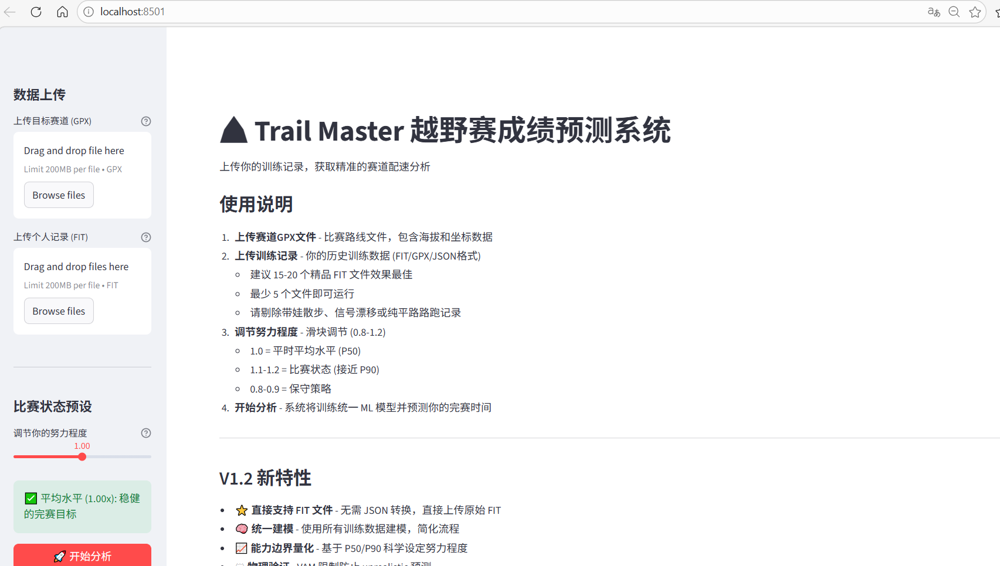

# Trail Master - 越野赛成绩预测系统

**版本**: V1.2.2



---

### 简介

Trail Master 是一个基于机器学习的越野赛成绩预测工具。通过分析你的历史训练数据，预测你在目标赛道上的完赛时间和分段配速。

本系统采用 LightGBM 梯度提升框架，结合运动生理学原理，为越野跑者提供科学、可靠的成绩预测。

### 核心特性

- **直接支持 FIT 文件** - 无需转换，直接上传 Garmin/Coros 导出的原始 FIT 文件
- **统一建模** - 使用所有训练数据训练单一模型，简化使用流程
- **表现区间预测** - 基于 P50/P90 能力边界，量化不同竞技状态下的成绩
- **物理约束** - VAM (垂直上升速度) 限制，防止不切实际的预测
- **Web 界面** - Streamlit 驱动的友好界面，拖拽上传即可使用

### 快速开始

#### 1. 进入项目目录

打开命令行（Windows: 按 `Win+R`，输入 `cmd`），执行：

```bash
cd d:\path\to\trail_race_predictor_v1.2
```

#### 2. 安装依赖

```bash
pip install -r requirements.txt
```

#### 3. 启动程序

```bash
streamlit run app.py
```

启动后浏览器会自动打开 **http://localhost:8501**，显示 Web 界面。

#### 使用流程

1. **上传赛道** - 上传比赛的 GPX 路线文件（需包含海拔数据）
2. **上传训练记录** - 上传 15-20 个精品 FIT 文件（最少 5 个）
3. **调节表现系数** - 滑块调节 0.8-1.2
   - `1.0` = 平时平均水平 (P50)
   - `1.1-1.2` = 比赛状态 (接近 P90)
   - `0.8-0.9` = 保守策略
4. **开始分析** - 系统自动训练模型并生成预测

### 数据要求

| 文件类型 | 格式 | 要求 |
|---------|------|------|
| 赛道 | GPX | 必须包含海拔数据 |
| 训练记录 | FIT | 建议 15-20 个精品文件，最少 5 个 |

**注意**: 请剔除以下类型的记录：
- 带娃散步、通勤骑行
- 信号漂移严重的数据
- 纯平路路跑（无爬升）

---

## 技术原理

### 1. 机器学习模型

#### 算法选择：LightGBM

本系统采用微软开发的 LightGBM (Light Gradient Boosting Machine) 梯度提升框架，相比传统线性回归具有以下优势：

| 特性 | 线性回归 | LightGBM |
|------|---------|----------|
| 非线性关系 | ❌ 无法捕捉 | ✅ 自动学习 |
| 特征交互 | ❌ 需手动设计 | ✅ 自动发现 |
| 过拟合风险 | 低 | 中 (通过正则化控制) |
| 小数据表现 | 一般 | 优秀 |
| 可解释性 | 高 | 中 (特征重要性) |

#### 模型性能

| 指标 | 数值 | 说明 |
|------|------|------|
| MAE | 0.02-0.07 km/h | 平均绝对误差 |
| RMSE | 0.03-0.10 km/h | 均方根误差 |
| R² | 0.85-0.92 | 决定系数 |

### 2. 特征工程

模型使用 6 个精心设计的特征预测速度：

| 特征 | 说明 | 重要性 | 科学依据 |
|------|------|--------|----------|
| `grade_pct` | 当前坡度 (%) | 35-40% | 坡度是影响越野跑速度的最主要因素 |
| `accumulated_distance_km` | 累计距离 | 30-35% | 反映疲劳累积效应 |
| `accumulated_ascent_m` | 累计爬升 | 15-20% | 爬升消耗对后续表现的影响 |
| `elevation_density` | 爬升密度 (m/km) | 5-10% | 赛道难度指标 |
| `rolling_grade_500m` | 过去 500m 平均坡度 | 5-8% | 地形连续性影响配速策略 |
| `absolute_altitude_m` | 绝对海拔 | 2-5% | 高原效应 (数据有限) |

### 3. 数据预处理

#### 海拔数据滤波

原始 GPS/海拔数据存在噪声，本系统采用 Savitzky-Golay 滤波进行平滑处理：

- **GPX 文件**：重采样间隔 20m，滤波窗口 7 点，坡度截断 ±45%
- **FIT 文件**：无重采样，滤波窗口 7-10 秒，坡度截断 ±50%

### 4. 能力边界量化

- **P50 (中位数速度)**：代表日常训练水平，约 50% 的训练达到此速度
- **P90 (第 90 百分位速度)**：代表极限能力，仅 10% 的训练达到此速度

### 5. 物理约束

#### VAM (垂直上升速度) 限制

```
VAM = 水平速度 (km/h) × 10 × 坡度 (%)
```

**本系统限制**：VAM ≤ 1000 m/h（业余→精英水平上限）

### 6. FIT 文件缓存

重复训练时自动跳过已解析的 FIT 文件（基于内容 MD5 hash），缓存路径：
`~/.trail_race_predictor/fit_cache/`

---

## 目录结构

```
trail_race_predictor_v1.2/
├── app.py                    # Streamlit 主程序
├── core/
│   ├── predictor/            # ML 预测器包 (LightGBM)
│   │   ├── __init__.py
│   │   ├── predictor.py      # 预测器主入口
│   │   ├── extractor.py     # 特征提取 (含 FIT 缓存)
│   │   ├── model.py         # LightGBM 模型
│   │   ├── gpx_parser.py    # GPX 路线解析
│   │   ├── features.py      # 分段特征定义
│   │   └── cli.py           # CLI 入口
│   ├── types.py             # 类型定义
│   └── utils.py             # 滤波工具
├── data/
│   ├── file_handler.py      # 文件处理
│   └── data_validator.py    # 数据验证
├── maps/                    # 赛道 GPX 文件
├── records/                 # 训练记录 FIT 文件
└── temp/                    # 临时文件
```

---

## 依赖项

```
streamlit>=1.28.0
numpy>=1.20.0
scipy>=1.7.0
lightgbm>=3.3.0
fitparse>=1.2.0
pandas>=2.0.0
plotly>=5.18.0
gpxpy>=1.6.0
```

## 许可证

MIT License

## 版本历史

| 版本 | 日期 | 更新内容 |
|------|------|----------|
| V1.2.2 | 2026-04-05 | 重构 predictor 为包结构，恢复 FIT 文件缓存 |
| V1.2 | 2026-04-01 | 增强技术文档，提升可信度 |
| V1.1 | 2026-03-31 | 统一建模，FIT 支持，努力程度量化 |
| V1.0 | 2026-03-30 | 初始版本，LightGBM 预测 |
